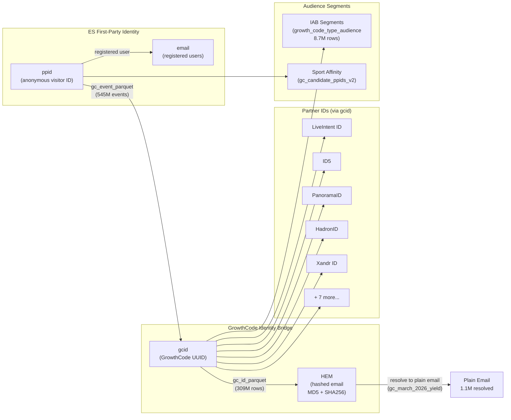
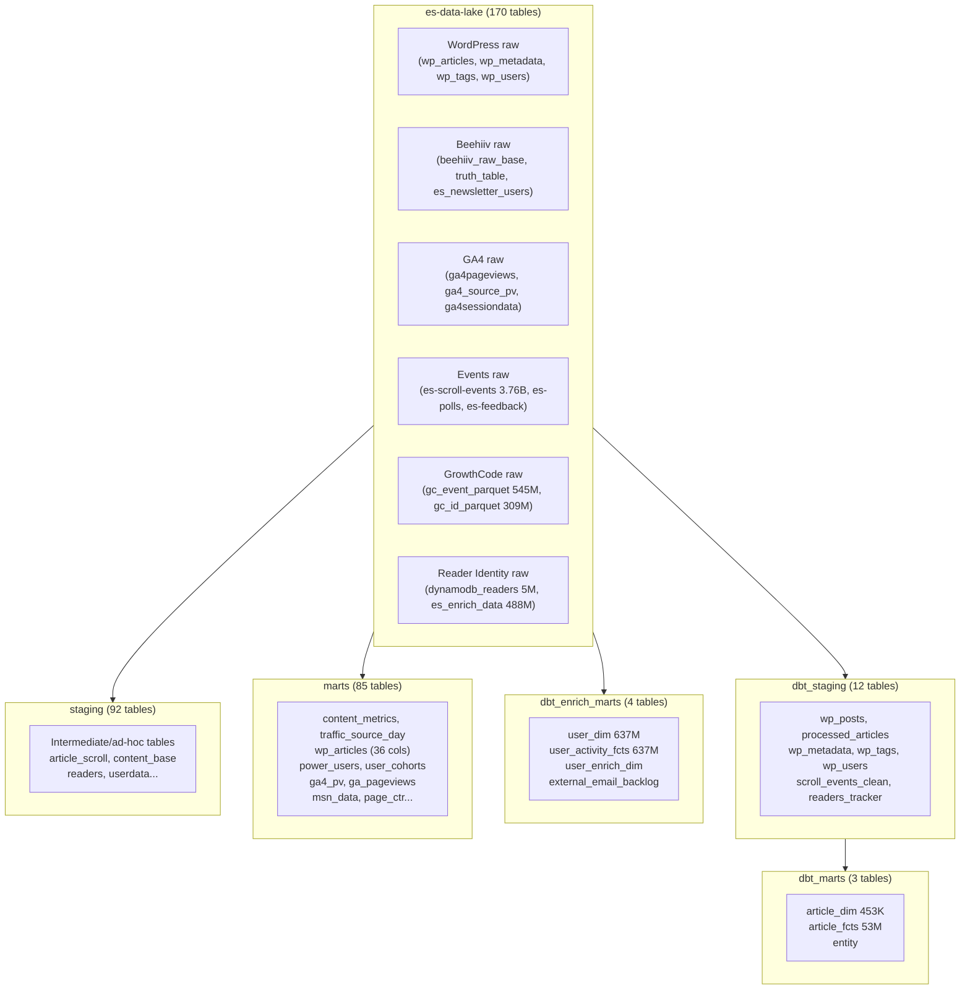

# EssentiallySports — Holistic Data Landscape

---

## Overview: 6 Core Data Domains

| Domain | Key Tables | Scale | Purpose |
|---|---|---|---|
| **Content / WordPress** | wp_articles, wp_metadata, wp_tags | 453K articles | Source of truth for all published content |
| **Newsletter / Beehiiv** | beehiiv_raw_base, truth_table, es_newsletter_users | 649M raw rows, 7M subscribers | Newsletter subscriber lifecycle & performance |
| **Reader Identity / Enrichment** | dynamodb_readers, es_enrich_data, user_dim | 637M users | First-party identity graph |
| **Behavioral Events** | es-scroll-events, es-feedback, es-polls | 3.76B scroll events | On-site engagement signals |
| **Traffic / GA4** | ga4pageviews, ga4_source_pv, google_search | 20M+ rows | Traffic attribution & SEO |
| **GrowthCode (Identity Resolution)** | gc_event_parquet, gc_id_parquet, gc_candidate_ppids_v2 | 545M events, 309M IDs | Anonymous → email identity bridging |

---

## Domain 1: Content / WordPress

### Data Flow
```
WordPress CMS
    │
    ├── wp_articles (es-data-lake)     453,883 rows   ← raw WP post table
    ├── wp_metadata (es-data-lake)   2,333,076 rows   ← post meta (SEO, editor data)
    ├── wp_tags (es-data-lake)         610,345 rows   ← post ↔ tag mapping
    └── wp_users (es-data-lake)          1,812 rows   ← editor/author accounts
          │
          └── dbt transforms
                ├── dbt_staging.wp_posts           453,883   ← cleaned, sports-tagged
                ├── dbt_staging.processed_articles 453,883   ← further enriched
                └── dbt_marts.article_dim          453,884   ← final content dimension
                      │
                      └── dbt_marts.article_fcts  53,027,510 ← 10-min grain performance facts
```

### Key Tables

**`dbt_marts.article_dim`** — The master content catalogue. One row per article.
Fields: slug, title, sports, writer, editor, alloted_by, publish_date, entity, content_type, event_type,
focus_keyword, current_news_or_throwback, auto_post, sentiment_score, p1_word_count, total_word_count,
sources, domains (external links), anchor_text, ytb (youtube embeds), is_headline, lead_story

**`dbt_marts.article_fcts`** — Article performance at 10-minute time buckets (53M rows).
Fields: scroll_pageview_amp/non_amp, scroll by source (google_discover, google_search, google_news,
facebook, reddit, beehiiv, msn, fanpage, flipboard), scroll_rate, avg_read_time, paragraph completion
rates (end_of_para1 through end_article), clicks, impressions, ctr, avg_nps_day

---

## Domain 2: Newsletter / Beehiiv

### Data Flow
```
Beehiiv API (multi-publication)
    │
    ├── beehiiv_raw_base (es-data-lake)        649,744,845 rows  ← ALL sub events (append-only)
    ├── es_newsletter_users (es-data-lake)       7,904,093 rows  ← current subscriber snapshot
    ├── truth_table (es-data-lake)               7,023,900 rows  ← authoritative status per email+newsletter
    ├── beehiiv_exports (es-data-lake)             580,061 rows  ← subscriber export snapshots
    ├── beehiiv_performance_daily (es-data-lake)    23,273 rows  ← daily send stats per publication+segment
    ├── beehiiv_daily_snapshot_base                    640 rows  ← daily subscriber count per pub
    └── post_metrics_master (es-data-lake)          39,807 rows  ← per-email post performance
          │
          └── Postmark (transactional email)
                ├── postmark_delivery    9,917 rows
                ├── postmark_opens       2,261 rows
                └── postmark_clicks        725 rows
```

### Key Tables

**`truth_table`** — The authoritative subscriber list. One row per email+newsletter combo.
Fields: email, newsletter (e.g. `sgg`, `th`, `ldot`, `cbh`), status (active_main/active_warmup/unsub/churn),
sub_status (opener/engagement_clicker/etc.), last_updated

**`beehiiv_performance_daily`** — Daily send performance per publication+segment.
Fields: date, publication_id, nl, nl_tag, segment_id, segment_name, status, subscriber_count,
total_sent, total_received, total_unique_opened, total_unique_clicked, open_rate, click_rate,
delivery_rate, conversion_rate, avg_es_age_days (how old the subscriber is in days)

**`beehiiv_raw_base`** — Raw append-only log of all subscriber state changes (649M rows!).
Fields: id, email, status, created, subscription_tier, tags, referring_url, etc.

### Newsletter Codes
- `sgg` — Sports Gossip Girl (or similar)
- `th` — The Highlight (or similar)
- `ldot` — Let's Do Our Thing (warmup newsletter)
- `cbh` — College Basketball Hype (or similar)
- `mma` — MMA newsletter
- `nfl` — NFL newsletter
(exact names TBD — decode via beehiiv_daily_snapshot_base.nl field)

---

## Domain 3: Reader Identity & Enrichment

### Data Flow
```
ES Website (login/registration)
    │
    ├── DynamoDB readers table
    │       └── dynamodb_readers (es-data-lake)  5,078,996 rows  ← ppid, email, SSO provider
    │
    ├── ES Enrich pipeline (IP + behavioral enrichment)
    │       └── es_enrich_data (es-data-lake)  488,388,869 rows  ← ppid + email + geo + demo
    │
    └── dbt Enrich layer (dbt_enrich_marts)
            ├── user_dim              637,011,799 rows  ← master user dimension
            ├── user_activity_fcts    637,011,798 rows  ← behavioral aggregates per user
            └── user_enrich_dim                         ← demographic enrichment
```

### Key Tables

**`dynamodb_readers`** — First-party registered users from DynamoDB.
Fields: ppid, email, ppid, emailverified, readername, issuername (SSO provider: google/apple/etc),
latesttokenissuedate, photourl

**`dbt_enrich_marts.user_dim`** — Master user dimension table (637M rows).
Fields: user_dim_sk (surrogate key), user_dim_nk, ppid, country, hashed_email, email_domain,
is_email_verified, issuer_name, photo_url, first_login_date, is_registered_user, last_updated

**`dbt_enrich_marts.user_activity_fcts`** — Richest user behaviour table (637M rows).
Fields: ppid, visit_count, sports_with_visit_count (MAP), no_of_sports_interested, top_sport,
top_sport_visits, entity_with_visit_count (MAP), top_entity, top_entity_visits,
latest_article_read, latest_referrer, latest_sport_read, total_engagement,
touchpoint_count (MAP), top_sources, timeonpage, per (scroll %), first_visit_timestamp,
latest_visit_timestamp, es_age (days since first visit), days_since_last_read_es,
articles_read_last_30_days, newsletter_mail, newsletter_counts (MAP), last_updated

**`dbt_enrich_marts.user_enrich_dim`** — Third-party demographic enrichment per ppid.
Fields: ppid, enrich_email, enrich_firstname, enrich_lastname, enrich_age, enrich_age_v2,
enrich_gender, enrich_gender_v2, enrich_state, enrich_city, enrich_zip, enrich_address,
enrich_url, enrich_referrer, enrich_confidences, enrich_date

---

## Domain 4: Behavioral Events

### Data Flow
```
ES Website pixel / event tracking
    │
    ├── es-scroll-events (es-data-lake)   3,765,220,837 rows  ← scroll depth per ppid+article
    ├── es-feedback-table (es-data-lake)        439,286 rows  ← NPS / rating feedback
    ├── es-polls-table (es-data-lake)            45,749 rows  ← poll responses
    ├── es-timeonpage-table (es-data-lake)       17,764 rows  ← time on page per session
    ├── es-article-reactions (es-data-lake)           ? rows  ← emoji reactions
    ├── es-openend-fb-table (es-data-lake)            ? rows  ← open-ended feedback
    └── es-fancast-table (es-data-lake)               ? rows  ← Fancast interactions
```

### Key Tables

**`es-scroll-events`** — The highest-volume table: 3.76 BILLION rows.
Fields: timestamp, ppid, slug, event (scroll%), percent, country, source

**`es-feedback-table`** — Aggregated article ratings.
Fields: ppid, timestamp, feedback_ques, feedback_type, rating

**`es-polls-table`** — Poll responses per ppid.
Fields: ppid, timestamp, poll_ques, poll_type, poll_response

---

## Domain 5: Traffic / GA4

### Data Flow
```
Google Analytics 4  ──────────────────────────────┐
    │                                              │
    ├── ga4pageviews (es-data-lake)  12,921,654   │ (same data, mirrored)
    ├── ga4_source_pv               20,186,625   │
    ├── ga4sessiondata                 280,134   │
    └── ga4userdemographics            480,715   │
                                                  │
Google Search Console                             │
    └── google_search (es-data-lake)       ?     │
                                                  │
                                    marts.ga4_pv  ┘ (12.9M — clean version)
                                    marts.traffic_source_day
                                    marts.source_analysis
```

### Key Tables

**`ga4_source_pv`** (20.2M) — Pageviews by source/medium per page per day.
Fields: date, pagepath, sessionsourcemedium, screenpageviews

**`ga4pageviews`** (12.9M) — Simple daily pageviews per page.
Fields: date, pagepath, screenpageviews

**`ga4sessiondata`** (280K) — Session-level traffic attribution.
Fields: date, sessionmedium, sessionsource, sessioncampaignname, views

**`ga4userdemographics`** (481K) — Age/gender/geo breakdown.
Fields: date, usergender, country, city, totalusers

**`google_search`** — Google Search Console data.
Fields: date, query, clicks, impressions, ctr

---

## Domain 6: GrowthCode (Identity Resolution)
*(See growthcode_dataset.md for full detail)*

Short summary:
- **545M event rows** linking ppid ↔ gcid per page visit
- **309M ID rows** linking gcid to 12 partner IDs (LiveIntent, ID5, PanoramaID, etc.)
- **7.4M ppid records** with sport affinity + HEM + country
- **1.1M email yield** from March 2026 purchase (Golf, NASCAR, WNBA, Tennis)

---

## Full Data Flow Diagram (Mermaid)

```mermaid
flowchart TD
    subgraph SOURCES["📥 Data Sources"]
        WP["WordPress CMS\n453K articles"]
        BH["Beehiiv API\n649M sub events"]
        GA["Google Analytics 4\n20M+ rows"]
        GSC["Google Search Console"]
        DDB["DynamoDB\n5M registered users"]
        ES_PIX["ES Tracking Pixel\n3.76B scroll events"]
        GC_API["GrowthCode API\n545M events"]
        PM["Postmark\n(transactional email)"]
    end

    subgraph RAW["🗄️ Raw Layer — es-data-lake"]
        WP_ART["wp_articles\n453K"]
        WP_META["wp_metadata\n2.3M"]
        WP_TAGS["wp_tags\n610K"]
        BH_RAW["beehiiv_raw_base\n649M"]
        TRUTH["truth_table\n7M"]
        NL_USERS["es_newsletter_users\n7.9M"]
        BH_PERF["beehiiv_performance_daily"]
        GA_PV["ga4pageviews\n12.9M"]
        GA_SRC["ga4_source_pv\n20.2M"]
        READERS["dynamodb_readers\n5M"]
        ENRICH["es_enrich_data\n488M"]
        SCROLL["es-scroll-events\n3.76B"]
        POLLS["es-polls-table\n46K"]
        FEEDBACK["es-feedback-table\n439K"]
        GC_EVT["gc_event_parquet\n545M"]
        GC_IDS["gc_id_parquet\n309M"]
        GC_PPID["gc_candidate_ppids_v2\n7.4M"]
        POST_DEL["postmark_delivery"]
    end

    subgraph DBT["⚙️ dbt Transform Layer"]
        WP_POSTS["dbt_staging.wp_posts\n453K"]
        PROC_ART["dbt_staging.processed_articles\n453K"]
        ART_DIM["dbt_marts.article_dim\n453K"]
        ART_FCTS["dbt_marts.article_fcts\n53M"]
        USER_DIM["dbt_enrich_marts.user_dim\n637M"]
        USER_ACT["dbt_enrich_marts.user_activity_fcts\n637M"]
        USER_ENR["dbt_enrich_marts.user_enrich_dim"]
    end

    subgraph OUTPUTS["📊 Outputs & Use Cases"]
        AUD_EXP["Audience Exports\n(ad targeting)"]
        GC_YIELD["GrowthCode Yield\ngc_march_2026_yield\n1.1M emails"]
        DASH["Analytics Dashboards"]
        NL_SEG["Newsletter Segments\n(warmup / main)"]
        CONTENT_PERF["Content Performance\nReporting"]
    end

    WP --> WP_ART & WP_META & WP_TAGS
    BH --> BH_RAW & TRUTH & NL_USERS & BH_PERF
    GA --> GA_PV & GA_SRC
    GSC --> RAW
    DDB --> READERS
    ES_PIX --> SCROLL & POLLS & FEEDBACK
    GC_API --> GC_EVT & GC_IDS & GC_PPID
    PM --> POST_DEL

    WP_ART & WP_META & WP_TAGS --> WP_POSTS --> PROC_ART --> ART_DIM --> ART_FCTS
    READERS & ENRICH & SCROLL --> USER_DIM & USER_ACT & USER_ENR

    ART_FCTS --> CONTENT_PERF
    ART_DIM --> CONTENT_PERF
    GA_PV & GA_SRC --> DASH
    BH_PERF & TRUTH --> NL_SEG
    GC_PPID & GC_IDS --> AUD_EXP
    GC_PPID --> GC_YIELD
    USER_ACT --> AUD_EXP & NL_SEG
```



---

## Identity Resolution Map (Mermaid)



---

## Database Architecture (Mermaid)



---

## Scale Summary

| Table | Rows | Domain |
|---|---|---|
| `es-scroll-events` | **3,765,220,837** | Events |
| `beehiiv_raw_base` | **649,744,845** | Newsletter |
| `gc_event_parquet_full_table` | **545,860,235** | GrowthCode |
| `es_enrich_data` | **488,388,869** | User Identity |
| `gc_id_parquet_full_rebuilt` | **309,706,685** | GrowthCode |
| `dbt_enrich_marts.user_dim` | **637,011,799** | User Identity |
| `dbt_enrich_marts.user_activity_fcts` | **637,011,798** | User Identity |
| `dbt_marts.article_fcts` | **53,027,510** | Content |
| `ga4_source_pv` | **20,186,625** | Traffic |
| `ga4pageviews` | **12,921,654** | Traffic |
| `gc_candidate_ppids_helper_v2` | **7,361,199** | GrowthCode |
| `es_newsletter_users` | **7,904,093** | Newsletter |
| `truth_table` | **7,023,900** | Newsletter |
| `dynamodb_readers` | **5,078,996** | User Identity |
| `wp_articles` | **453,883** | Content |

---

## Key Observations

1. **Identity is fragmented across 3 systems** — ES ppid (DynamoDB), Beehiiv subscriber ID, and GrowthCode gcid. The `gc_candidate_ppids_helper_v2` table is the best single join point.

2. **beehiiv_raw_base is append-only** (649M rows for ~7M subscribers) — never use it for current state; use `truth_table` or `es_newsletter_users` instead.

3. **dbt_enrich_marts.user_activity_fcts is the richest user table** — 637M rows with MAP columns for sport→visits, entity→visits, newsletter→counts, and source→visits. All in one row per user.

4. **es-scroll-events (3.76B) is the most granular signal** — every scroll checkpoint per ppid+article. Use `dbt_marts.article_fcts` (53M, pre-aggregated) for most analysis instead.

5. **GrowthCode data has a ~6-day lag** — event table last updated Apr 14, 2026 as of Apr 20, 2026.

6. **Content pipeline has ~30-60 min lag** — wp_articles in Athena trails WordPress live by up to 1 hour.

7. **marts database (85 tables) has many stale/empty tables** — several show 0 rows (content_metrics, power_users). Prefer `dbt_marts` and `dbt_enrich_marts` for reliable data.
